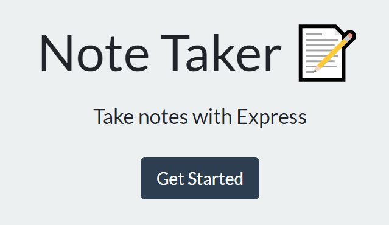
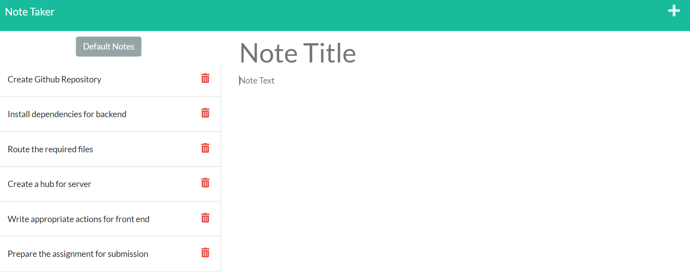
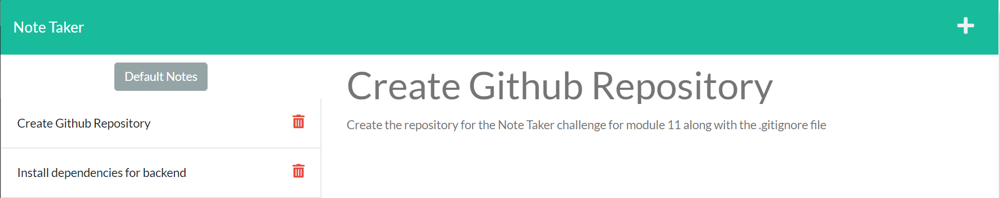
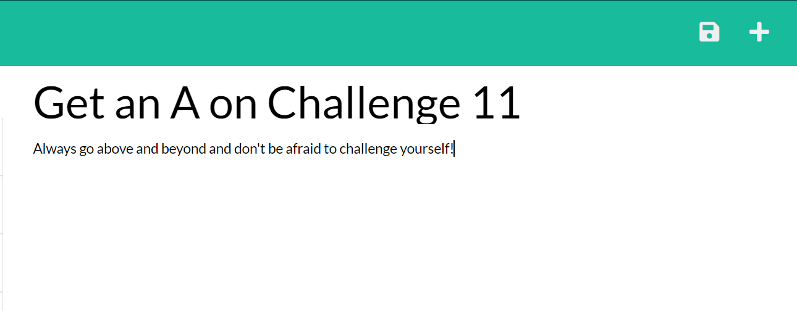
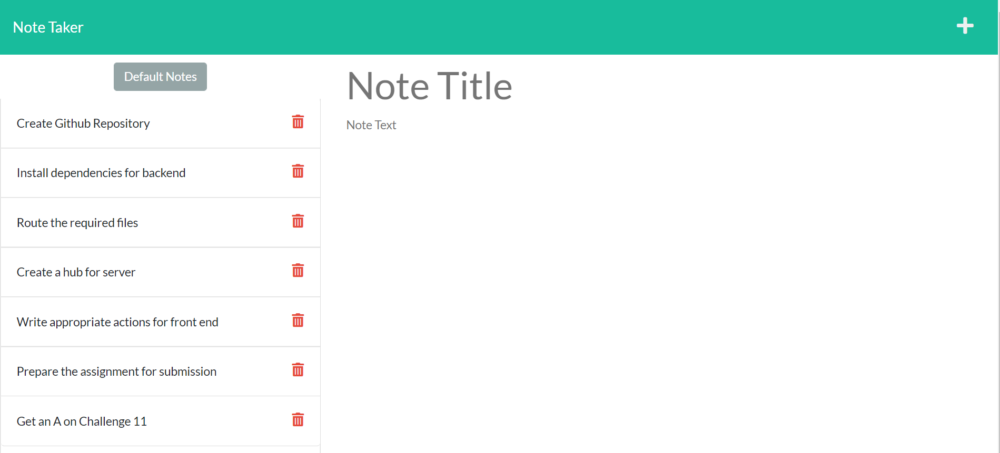
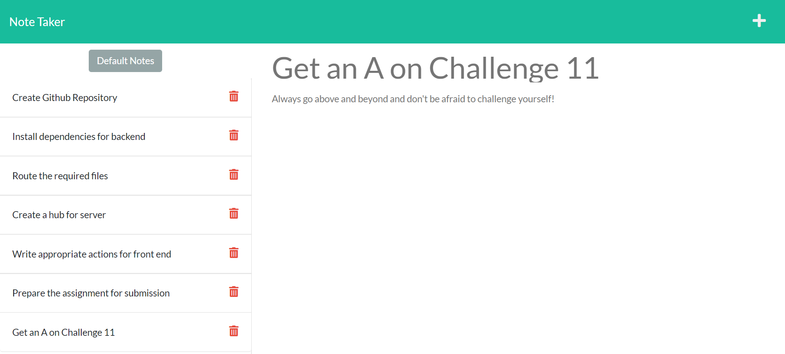
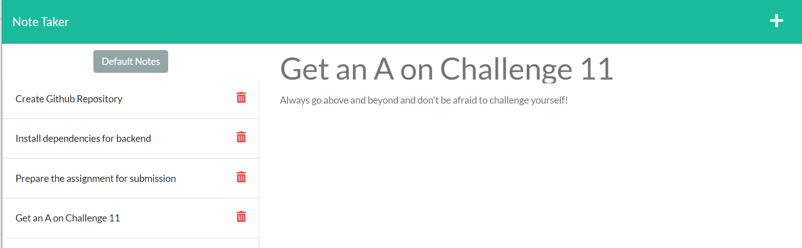
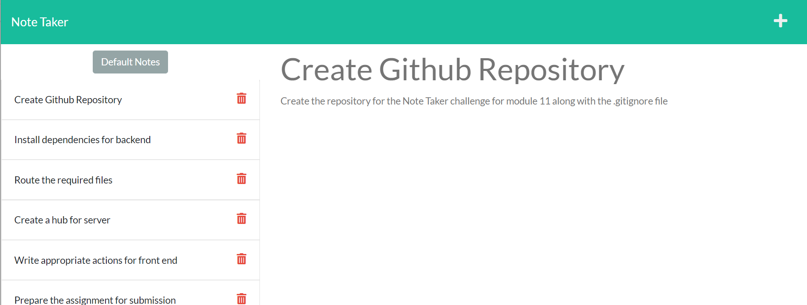
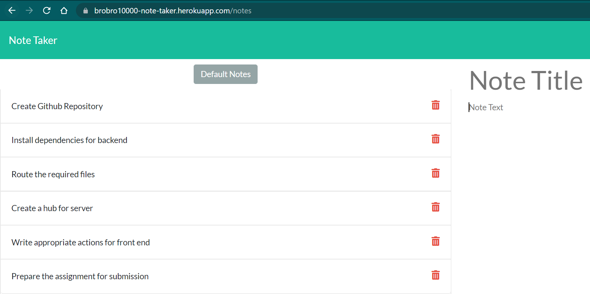
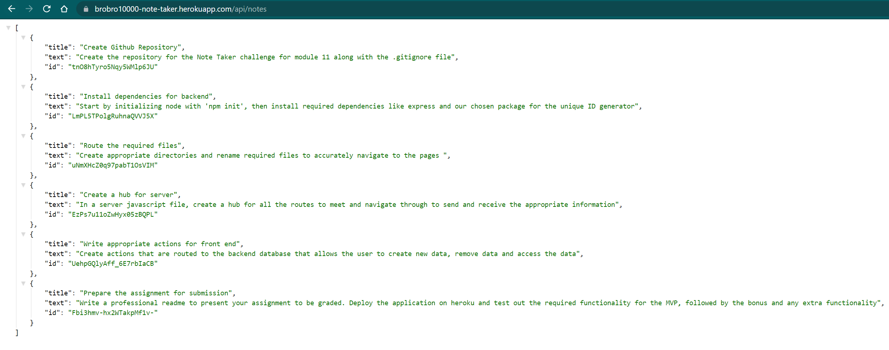

# Note Taker

## **The Note Taker**
This program allows you to write, save and delete notes to a database and retrieve them on page load. Using express for the backend, we integrated the front end html, javascript and css to seamlessly integrate together to provide the user with usable note taking application in a cloud based environment.

- On page load, the index is simple yet modern, giving straitforward instructions on how to use the application.

- Upon entry, you are greeted with a split layout, with current notes on the left and either the current note selection on the right, or the ability to enter new notes. 

- The user can select on a note that already that is in the list and it will display on the right side of the screen. 

- By selecting the + on the top right of the screen, we can enter a new note. The floppy disk appears once the title and text area has some input. We can save our note by pressing the floppy disk.

- After saving the note, it will immediately appear on the left side at the very bottom of the list.

- The note will also be available to view right away without refreshing the page.

- By pressing the trashcan, we can delete notes from the list

- By pressing the default note button, we can clear the existing list and display our default note that was on the initial page load

- Having on site deployed on Heroku, we can navigate the pages right form the URL

- We can also navigate to the database through [api/notes](https://brobro10000-note-taker.herokuapp.com/api/notes)

# Why it Matters?
Using express is a quick and simple way to get a server set up through your local host with a multitude of features. Pairing it with a free hosting service such as [Heroku](https://www.heroku.com/about), we can have an application up and running in no time! A note taker app is a great introduction into creating a simple program using backend data tied in with front end functionality. 

Visit my Note Taker [by clicking here](https://brobro10000-note-taker.herokuapp.com/) or follow the direct link at [https://brobro10000-note-taker.herokuapp.com/](https://brobro10000-note-taker.herokuapp.com/). 

## 
We Hope to see you there!
 ##
